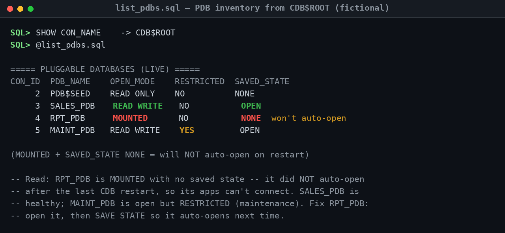
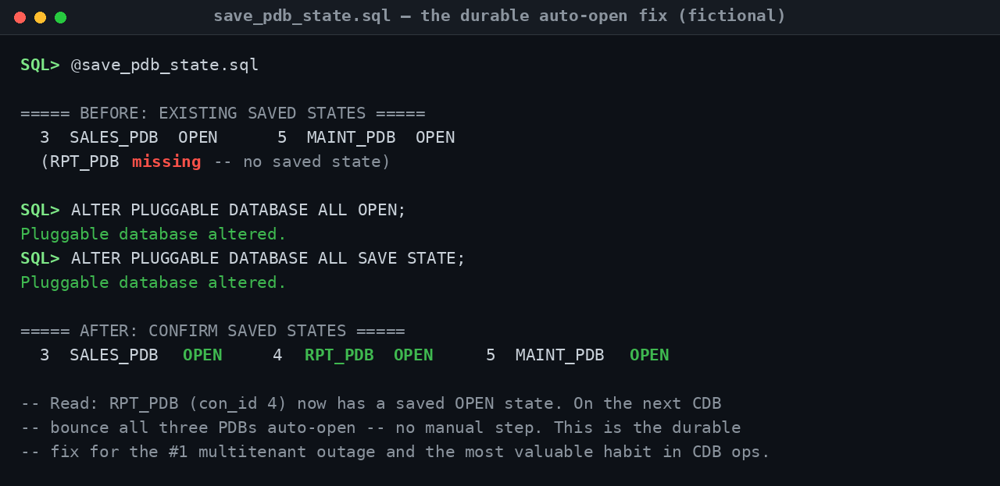
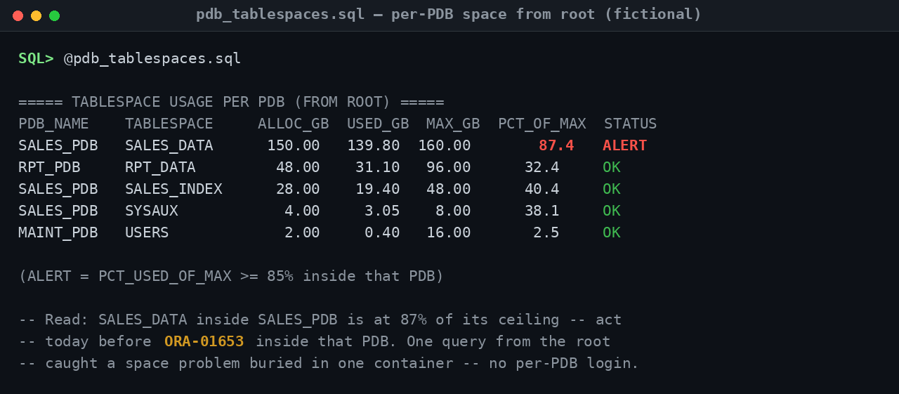
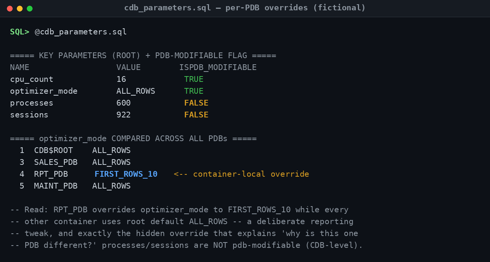
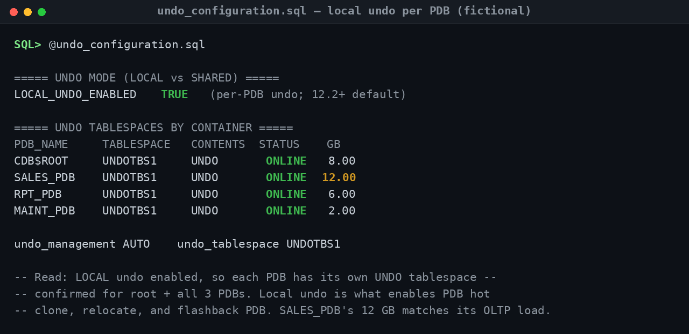

## Operational Screenshots (Proof of Work)

Multitenant is the default architecture for modern Oracle, and the gap between a DBA who *has used* CDB/PDB and one who *operates it well* shows up in the gotchas — PDBs that don't auto-open, services missing after a clone, parameters quietly overridden in one container, undo configured per-PDB. This section shows the scripts in this repository surfacing exactly those things from a single `CDB$ROOT` session, against a sanitized demo CDB (`ORADEMO`). Every container name and value is fictional.

The first two captures tell one complete operational story — the #1 multitenant outage and its durable fix. The last three show the container-aware fluency that separates senior from principal: catching a space problem buried inside one PDB, spotting a hidden per-PDB parameter override, and confirming the undo model that makes clone/relocate/flashback possible. The thread throughout: **from the root, you can see and fix every container at once — if you know what to look for.**

---

### 1 · Diagnosing the #1 multitenant outage (`list_pdbs.sql`)

**Problem demonstrated.** The single most common multitenant incident: after a CDB restart, an application can't connect — not because the database is down, but because *its* PDB never opened. This inventory from the root finds it instantly.

**What an experienced DBA concludes.** The story is on one line: `RPT_PDB` is `MOUNTED` with `SAVED_STATE = NONE`, so it did **not** auto-open after the last CDB restart — which is precisely why its applications are failing. `SALES_PDB` is healthy (`READ WRITE` + saved), and `MAINT_PDB` is open but `RESTRICTED`, signalling deliberate maintenance rather than a fault. A senior DBA reads open mode, restricted flag, *and* saved state together — each tells a different part of the container's health.

**Troubleshooting takeaway.** When "the database is up but one app can't connect" on a multitenant system, check the PDB's open mode first — a `MOUNTED` PDB is the usual culprit. And always read `RESTRICTED`: a PDB open in restricted mode will refuse normal app logins even though it looks "open."

---

### 2 · The durable fix, not the band-aid (`save_pdb_state.sql`)

**Problem demonstrated.** Opening a closed PDB restores service *now* — but if you stop there, the same outage returns on the very next reboot. This is the step that makes the fix permanent.

**What an experienced DBA concludes.** The before/after is the whole point. Initially only `SALES_PDB` and `MAINT_PDB` had a saved state; after `ALTER PLUGGABLE DATABASE ALL OPEN` followed by `ALL SAVE STATE`, `RPT_PDB` (con_id 4) now carries a saved `OPEN` state too. On the next CDB bounce, all three auto-open with no manual intervention. This is the difference between *reacting* to the outage every reboot and *eliminating* it — the single most valuable habit in multitenant operations.

**Troubleshooting takeaway.** Opening a PDB and saving its state are two separate actions — `OPEN` fixes now, `SAVE STATE` fixes forever. Make "open the mode you want, then SAVE STATE" the reflex, and the recurring post-restart outage simply stops happening.

---

### 3 · Catching space trouble inside a container — from the root (`pdb_tablespaces.sql`)

**Problem demonstrated.** Space problems in multitenant hide *inside* containers. A tablespace can be racing toward its ceiling in one PDB while the CDB as a whole looks fine — and logging into each PDB separately to check doesn't scale.

**What an experienced DBA concludes.** One query from `CDB$ROOT` surfaced it: `SALES_DATA` inside `SALES_PDB` is at 87% of its autoextend ceiling — an `ALERT` — while every other tablespace across every container has headroom. The action is clear and contained: add a datafile or raise `MAXSIZE` in that PDB today, before inserts fail with `ORA-01653` *inside that container*. The principal-level point is the method: container-aware monitoring from a single session, not ten separate logins.

**Troubleshooting takeaway.** Monitor tablespaces from the root with the container included in the output — a CDB-wide "looks fine" can hide one PDB at 95%. And remember `ORA-01653` is per-tablespace per-PDB: the fix belongs in the affected container, not the root.

---

### 4 · Spotting the hidden per-PDB override (`cdb_parameters.sql`)

**Problem demonstrated.** "Why does this one PDB behave differently from the others?" In multitenant, a PDB can override the root's parameter values — and those container-local overrides are invisible unless you go looking for them.

**What an experienced DBA concludes.** The comparison across containers exposes it: `RPT_PDB` runs `optimizer_mode = FIRST_ROWS_10` while `CDB$ROOT`, `SALES_PDB`, and `MAINT_PDB` all use the default `ALL_ROWS`. That's a deliberate reporting-PDB tweak — but it is exactly the kind of hidden override that explains divergent behaviour or a plan that only goes wrong in one container. The other tell of real depth: `processes` and `sessions` show `ISPDB_MODIFIABLE = FALSE`, so they're set once at the CDB level and can't be tuned per-PDB.

**Troubleshooting takeaway.** When one PDB behaves differently, compare the parameter across all containers before suspecting data or stats — a local override is a frequent, easily-missed cause. And know which parameters are `ISPDB_MODIFIABLE`: trying to set a CDB-level-only parameter inside a PDB simply won't take.

---

### 5 · Confirming the undo model that enables clone & flashback (`undo_configuration.sql`)

**Problem demonstrated.** Whether undo is **local** (per-PDB) or **shared** (one undo in the root) isn't a trivia question — it determines which modern multitenant features you can actually use. This check confirms the model before anyone relies on it.

**What an experienced DBA concludes.** `LOCAL_UNDO_ENABLED = TRUE` (the 12.2+ default), and the per-container listing proves it: the root and all three PDBs each have their own `ONLINE` undo tablespace. That matters because **local undo is the prerequisite for PDB hot clone, relocate, and flashback PDB** — so this configuration is correct for any environment that uses those operations. The detail that shows attention: `SALES_PDB`'s larger 12 GB undo tracks its heavier OLTP write workload, not a misconfiguration.

**Troubleshooting takeaway.** Confirm `LOCAL_UNDO_ENABLED` before promising features like hot clone, relocate, or flashback PDB — they require it, and switching from shared to local undo is a deliberate operation, not a flag flip. Sizing undo per-PDB to each container's write profile is the senior touch.

---

> **All screenshots are fully sanitized and fictional.** Container names (`ORADEMO`, `SALES_PDB`, `RPT_PDB`, `MAINT_PDB`), tablespace and parameter values, and every figure are illustrative demo data created for this portfolio — no production, employer, or confidential information is shown. The samples deliberately trace one CDB through a consistent scenario. Each capture mirrors the annotated output in [`sample_outputs/`](sample_outputs/), where every example ends with a **"Read:"** note explaining the finding and the action.
