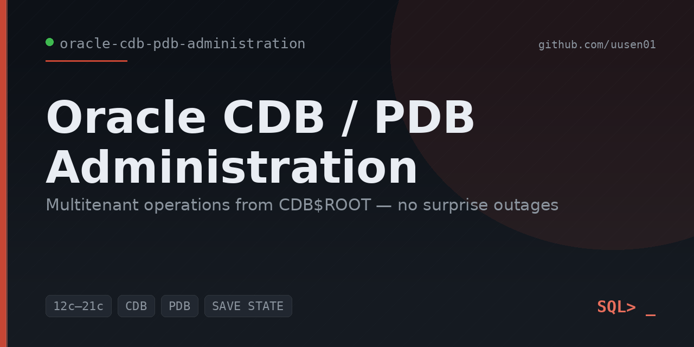

<p align="center">
  
</p>

# Oracle CDB/PDB Administration

A focused toolkit of **read-only SQL scripts** and operational guides for administering
Oracle **Multitenant** (Container / Pluggable Database) environments on 12c/19c/21c.
Everything runs from the CDB root and gives a consolidated, container-aware view of a
multitenant database — open state, services, sizing, users, parameters, and undo.

Multitenant is the default architecture for modern Oracle, and the operational gotchas
(PDBs not auto-opening, missing services after a clone, per-PDB parameter overrides) are
exactly what separates a DBA who *has used* CDB/PDB from one who *operates it well*. This
repo encodes that operational fluency.

---

## Purpose

Consolidating many databases into one CDB saves overhead but adds a layer: you now manage
**containers**. The questions change — which PDBs are open? will they come back after a
reboot? which container owns this service, this space, this user, this parameter? These
scripts answer those questions from a single root session, and the docs turn the answers
into safe daily practice — including the auto-open habit that prevents the most common
multitenant outage.

---

## Supported versions

| Oracle version | Status |
|---|---|
| Oracle Database **12c** (12.1 / 12.2) | ✅ Supported (multitenant introduced in 12.1) |
| Oracle Database **18c** | ✅ Supported |
| Oracle Database **19c** | ✅ Supported |
| Oracle Database **21c** | ✅ Supported |

All scripts run from **CDB$ROOT** and use the `CDB_*` / `V$PDBS` container views, which are
stable across these releases. Local undo (default 12.2+) is detected, not assumed.

---

## ⚠️ Disclaimer — sanitized & generic by design

All scripts, sample outputs, and documentation are **fully sanitized and generic**. They
contain **no** real hostnames, IPs, SIDs, service names, credentials, or employer/company
data. Container names (`SALES_PDB`, `RPT_PDB`, `MAINT_PDB`, `ORADEMO`), schema names, and
all values in `sample_outputs/` are **fictional**, written to show what a run looks like
and how to read it. These are reference scripts for portfolio and educational use — test
in a non-production environment first.

---

## Script index

All scripts are read-only and run from `CDB$ROOT`.

| Script | What it answers |
|---|---|
| [`list_pdbs.sql`](scripts/list_pdbs.sql) | Which PDBs exist, their open mode, restricted flag, and saved state |
| [`open_all_pdbs.sql`](scripts/open_all_pdbs.sql) | Open all mounted PDBs after a restart (with before/after) |
| [`save_pdb_state.sql`](scripts/save_pdb_state.sql) | Make PDBs auto-open on restart — the durable fix |
| [`pdb_services.sql`](scripts/pdb_services.sql) | The service-to-PDB mapping (app connectivity) |
| [`cdb_services.sql`](scripts/cdb_services.sql) | CDB-wide service inventory (root + all PDBs) |
| [`pdb_size.sql`](scripts/pdb_size.sql) | Size of each PDB (data + temp) and share of the CDB |
| [`pdb_tablespaces.sql`](scripts/pdb_tablespaces.sql) | Per-PDB tablespace usage vs autoextend ceiling |
| [`pdb_users.sql`](scripts/pdb_users.sql) | Common vs local users per container; app accounts |
| [`cdb_parameters.sql`](scripts/cdb_parameters.sql) | Key parameters + which a PDB has overridden |
| [`undo_configuration.sql`](scripts/undo_configuration.sql) | Local vs shared undo; undo tablespace per container |

A sanitized, annotated sample run of every script is in
[`sample_outputs/`](sample_outputs/). The samples are **consistent** — they trace one
container (`ORADEMO` with `SALES_PDB` / `RPT_PDB` / `MAINT_PDB`) through a realistic
scenario: `RPT_PDB` left mounted after a restart, opened, and its state saved.

---

## Usage

**Prerequisites:** SQL\*Plus or SQLcl, and a common user with `SELECT_CATALOG_ROLE` (plus
`ALTER PLUGGABLE DATABASE` for the open/save-state scripts). Connect to **CDB$ROOT**:

```
sqlplus / as sysdba
SQL> SHOW CON_NAME            -- confirm CDB$ROOT
SQL> @scripts/list_pdbs.sql
```

**Typical post-restart routine** (full detail in
[docs/PDB Startup Procedure.md](docs/PDB%20Startup%20Procedure.md)):

1. `list_pdbs.sql` → find PDBs left MOUNTED / without saved state
2. `open_all_pdbs.sql` → open them (restore service)
3. `save_pdb_state.sql` → make them auto-open next time
4. `pdb_services.sql` → confirm app services registered

---

## Sample output

From `list_pdbs.sql` (fictional data):

```
    CON_ID PDB_NAME               OPEN_MODE    RESTRICTED SAVED_STATE
---------- ---------------------- ------------ ---------- ------------
         3 SALES_PDB              READ WRITE   NO         OPEN
         4 RPT_PDB                MOUNTED      NO         NONE      <-- won't auto-open
         5 MAINT_PDB              READ WRITE   YES        OPEN
```

Each file in [`sample_outputs/`](sample_outputs/) ends with a **"Read:"** note explaining
the finding and the action.

---

## Documentation

| Doc | Contents |
|---|---|
| [CDB/PDB Administration Guide](docs/CDB-PDB%20Administration%20Guide.md) | The multitenant model, connecting to containers, common vs local, daily tasks, lifecycle overview |
| [Multitenant Troubleshooting](docs/Multitenant%20Troubleshooting.md) | Eight common multitenant problems — cause and fix for each |
| [PDB Startup Procedure](docs/PDB%20Startup%20Procedure.md) | The post-restart routine and how to guarantee PDBs auto-open |

---

## Repository structure

```
oracle-cdb-pdb-administration/
├── README.md
├── LICENSE
├── .gitignore
├── scripts/             # 10 read-only CDB/PDB administration scripts
├── sample_outputs/      # fictional, sanitized example output for each script
├── docs/                # admin guide, troubleshooting, startup procedure
└── screenshots/         # (optional) terminal captures for the portfolio
```

---

## Core principles

- **Know your container.** `SHOW CON_NAME` before acting; CDB-wide work from the root,
  app work inside the PDB.
- **Open the mode you want, then SAVE STATE** — the habit that prevents the most common
  multitenant outage.
- **Use the root's `CDB_*` views** to see every container at once before drilling in.
- **Watch the multitenant-specific layers** — services, saved state, per-PDB parameter
  overrides, and local vs shared undo.

---

## Future enhancements

- **PDB lifecycle scripts** — create, hot clone, plug/unplug, and relocate templates.
- **Resource Manager (CDB) setup** — CPU/parallel/memory shares so one PDB can't starve
  others.
- **PDB snapshot / refresh** examples for test-environment provisioning.
- **Per-PDB AWR** (`awr_pdb_report`) guidance (Diagnostics Pack).
- **Application Containers** (master + application PDBs) overview.

---

## License

Released under the [MIT License](LICENSE) — free to use, adapt, and share with
attribution.
